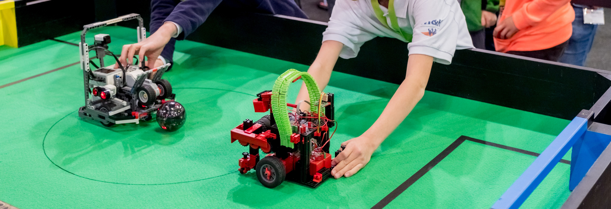

= RoboCupJunior Soccer Entry Rules 2025
{docdate}
:toc: left
:sectanchors:
:sectlinks:
:xrefstyle: full
:section-refsig: Rule
:sectnums:

ifdef::basebackend-html[]
++++
<link rel="stylesheet" href="https://use.fontawesome.com/releases/v5.3.1/css/all.css" integrity="sha384-mzrmE5qonljUremFsqc01SB46JvROS7bZs3IO2EmfFsd15uHvIt+Y8vEf7N7fWAU" crossorigin="anonymous">

++++
endif::basebackend-html[]

:icons: font
:numbered:

IMPORTANT: Regional and
super-regional tournament organizers may use these rules, make changes
specific to their regions or not run Entry leagues at all. Contact your
regions or super-regions tournament organizers to find out which rules are
going to be played at your tournament.

NOTE: This ruleset is not intended to be used at international level, except for super-regional
tournaments.

These are the RoboCupJunior Soccer Entry rules for the *1:1 Lightweight League*
and *1:1 Standard Kit League*
proposed for suggested use by regional and super-regional tournaments in the 
2025 season. They are released by the RoboCupJunior League Committee. 
The English version of these rules has priority over any translations.

The aim of this document is to provide entry-level rulesets for RoboCupJunior Soccer
that are harmonized across regions and that may be used as-is or adapted to
specific needs at regional and super-regional tournaments. Some regions
already have their own, separate version of Soccer Entry rules. Teams are
advised to check with the local tournament organizers and Regional
Representative regarding updates and changes to this ruleset specific to their
location. Each team is responsible for verifying the correct and latest version
of the rules prior to competition.

[title="Two teams with one LWL robot each will compete using an IR ball on RCJ Soccer fields without the out-area. There is no need for using camera vision or line detection. Photo: Andreas Lander"]

[discrete]
== Preface

In the RoboCupJunior Soccer Entry challenge, teams of young engineers design, build,
and program one fully autonomous mobile robot to compete against
another team in matches. The robots must detect a ball and score into a color-coded goal on
a special field that resembles a human soccer field.

To be successful, participants must demonstrate skill in programming, robotics,
electronics and mechatronics. Teams are also expected to contribute to the
advancement of the community as a whole by sharing their discoveries with other
participants and by engaging in good sportsmanship, regardless of culture, age
or result in the competition. *All are expected to compete, learn, have fun, and grow.*

RoboCupJunior Soccer Entry rules are supplied for two entry-level. 
*1:1 Lightweight League* leagues modelled after LWL but reduced to one robot
and restricted to at most three driving motors and *1:1 Standard Kit League*
further restricted to two driving motors and restricted to a list of similarly
powered motors (see <<motor-whitelist>>).

== Differences to 2:2 League rulesets

These rules are based on the 2:2 rulesets. Their main differences
compared to those are:

=== Both 1:1 Leagues
* *The Field* has no out of bounds areas and gameplay may touch the walls. This
reduces the complexity of robot construction and gameplay. Use of many existing
fields is possible with no or minor modifications due to flexible dimensions.
* Each team starts *only one robot*
* *The Ball* the league uses the same special ball that emits an IR signal that
Lightweight League uses. Please see <<ball>> for balls specifications.
* Restrictions on the number of drive motors apply (max. 2 drive motors for *1:1 
Standard Kit League*, max. 3 drive motors for *1:1 Lightweight League*)
* In most regions participation in each 1:1 League is limited to two years (see <<competition-cap>>)
* Furthermore, robots that have been constructed for any of the 2:2 RobocupJunior Soccer leagues
at any level (local, regional, super-regional, international) in past, future, or present
may not be used at any 1:1 League match.

=== 1:1 Standard Kit League
* Number of drive motors is restricted to two
* Due to availability concerns with sensors and future products suitable for
RoboCupJunior Soccer use the restrictions to only Lego and Fischertechnik parts were
lifted. A number of changes were made to preserve the character of the league
and keep existing Lego and Fischertechnik robots competitive:
* Use of parts that are neither Lego nor Fischertechnik is permitted 
* A weight limit of 1400g is introduced
* Only a list of allowable motors (see <<motor-whitelist>>) with
comparable power to Lego and Fischertechnik motors is permitted

=== 1:1 Lightweight League
* Number of drive motors is restricted to three
* The voltage limit remains at 12V (unlike 2:2 LWL where it is increased)
* The weight limit for *1:1 Lightweight League* has been increased to match the 2:2 LWL level of 1400g

[discrete]
=== Changes from the 2024 RoboCupJunior Soccer Entry Rules

{+-~TOC-CHANGES~-+}

[[competition-cap]]
=== Competition Cap

Team members can participate only twice in each league played according to one of these
RoboCupJunior Soccer Entry rulesets. After their second participation, they need to
move on from *1:1 Standard Kit League* to *1:1 Lightweight League* and from 
*1:1 Lightweight League* to one of the 2:2 Leagues respectively.
footnote:[Some regions will have other entry leagues that may be exempt from this rule.
Please refer to your local tournament organizers in order to find out in which leagues
you may compete.]

Team members that participated in the 2:2 RoboCupJunior Soccer leagues
at any level (local, regional, super-regional, international) before may not
participate in the Entry league(s) again.

[discrete]
=== Construction and Programming have to be performed exclusively by the students

Robots must be constructed and programmed exclusively by student members of the
team. Mentors, teachers, parents or companies should not be involved in the
design, construction, assembly, programming or debugging of robots. To avoid
possible disqualification, it is extremely important that
teams abide by these leagues' regulations, especially <<regulations-construction>>
and <<regulations-programming>>, and all other competitor’s rules.

If in doubt, please consult with your Regional Representative before
registering your team.

[[gameplay]]
== GAMEPLAY

[[game-procedure-and-length-of-a-game]]
=== Game procedure and length of a game

RCJ Soccer games consist of two teams of one robot each, playing soccer against each
other. Each team has one autonomous robot. The game will consist of two
halves. The duration of each half is 10-minutes. There will be a 5-minute break
in between the halves.

The game clock will run for the duration of the halves without stopping (except
when a referee wants to consult another official). The game clock will be
run by a referee or a referee assistant (see <<referee-and-referee-assistant>>
for more information on their roles).

Teams are expected to be at the field 5 minutes before their game starts. Being
at the inspection table does not count in favor of this time limit. Teams that
are late for the start of the game may be penalized one goal *per 30 seconds*
at the referee’s discretion.

The final game score will be trimmed so that there is at most 10-goal
difference between the losing and the winning team.

[[pre-match-meeting]]
=== Pre-match meeting

At the start of the first half of the game, a referee will toss a coin. The
team mentioned first in the draw shall call the coin. The winner of the toss
can choose either which end to kick towards, or to kick off first. The loser of
the toss chooses the other option. After the first half, teams switch sides.
The team not kicking off in the first half of the game will kick off to begin
the second half of the game.

During the pre-match meeting the referee or their assistant may check whether
the robots are capable of playing (i.e., whether they are at least able to
follow and react to the ball). If none of the robots is capable of playing, the
game will not be played and zero goals will be awarded to both teams.

[[kick-off]]
=== Kick-off

Each half of the game begins with a kick-off. All robots must be located on
their own side of the field. All robots must be halted. The ball is positioned
by a referee in the center of the field.

The team kicking off places their robot on the field first.

The team not kicking off will now place their robot on the defensive end of
the field. The robot on the team not kicking off must be at least 30 cm away
from the ball (outside of the center circle).

Robots cannot be placed inside the goal. Robots cannot be
repositioned once they have been placed, except if the referee requests to
adjust their placement to make sure that the robots are placed properly within
the field positions.

On the referee’s command (usually by whistle), all robots will be started
immediately by each captain. Any robots that are started early will be removed
by the referee from the field and deemed damaged.

Before a kick-off, *all damaged robots* are allowed to return to
the playing field immediately if they are _ready and fully functional_.

If no robots are present at a kick-off (because they are damaged <<damaged-robots>>),
the penalties are discarded and the match resumes with a <<neutral-kickoff>>.

[[neutral-kickoff]]
==== Neutral kick-off

A neutral kick-off is the same as the one described in <<kick-off>> with a
small change: all robots must be at least 30 cm away from the ball
(outside of the center circle).

[[human-interference]]
=== Human interference

Except for the kick-off, human interference from the teams (e.g. touching the
robots) during the game is not allowed unless explicitly permitted by a
referee. Violating team(s)/team member(s) may be disqualified from the game.

The referee or a referee assistant can help robots get unstuck if the ball is
not being disputed near them and if the situation was created from normal
interaction between robots (i.e. it was not a design or programming flaw of the
robot alone). The referee or a referee assistant will pull back the robots just
enough for them to be able to move freely again.

[[ball-movement]]
=== Ball movement

A robot cannot hold a ball. Holding a ball is defined as taking full control of
the ball by removing all of degrees of freedom. Examples for ball holding
include fixing a ball to the robot’s body, surrounding a ball using the robot’s
body to prevent access by others, encircling the ball or somehow trapping the
ball with any part of the robot’s body. If a ball does not roll while a robot
is moving, it is a good indication that the ball is trapped.

The only exception to holding is the use of a rotating drum (a "dribbler") that
imparts dynamic back spin on the ball to keep the ball on its surface.

Other players must be able to access the ball.

The ball needs to stay within the bounds of the field, as defined by the
walls. If a robot moves the ball outside of the field (that is, beyond the walls
or above their height), it is deemed damaged. (<<damaged-robots>>)
[[scoring]]
=== Scoring

A goal is scored when the ball strikes or touches the back wall of the goal.
Goals scored by any robot have the same end result: they give one goal to the
team on the opposite side. After a goal, the game will be restarted with a
kick-off from the team who was scored against.

[[lack-of-progress]]
=== Lack of progress

Lack of progress occurs if there is no progress in the gameplay for a
reasonable period of time and the situation is not likely to change. Typical
lack of progress situations are when the ball is stuck between robots, when
there is no change in ball and robot’s positions, or when the ball is beyond
detection or reach capability of all robots on the field.

After a visible and loud count footnote:[usually a count of three],
a referee will call `*lack of progress*` and
will move the ball to the nearest unoccupied neutral spot. If this does not
solve the lack of progress, the referee can move the ball to a different
neutral spot.

[[damaged-robots]]
=== Damaged robots

If a robot is damaged, it has to be taken off the field and must be fixed
before it can play again. Even if repaired, the robot must remain off the field
for at least one minute or until the next kick-off is due.

Some examples of a damaged robot include:

* it does not respond to the ball, or is unable to move (it lost pieces,
power, etc.).
* it turns over on its own accord.

Computers and repair equipment are not permitted in the playing area during
gameplay. Usually, a team member will need to take the damaged robot to an
"approved repair table" near the playing area. A referee may permit robot
sensor calibration, computers and other tools in the playing area, only for the
5 minutes before the start of each half.

After a robot has been fixed, it will be placed on the unoccupied neutral spot
furthest from the ball, facing its own goal. A robot can only be returned to
the field if the damage has been repaired. If the referee notices that the
robot was returned to the field with the same original problem, they may ask
the robot to be removed and proceed with the game as if the robot had not been
returned.

*Only the referee decides whether a robot is damaged.* A robot can only be
taken off or returned with the referee’s permission.

Whenever a robot is removed from play, its motors must be turned off.

[[interruption-of-game-ref-interruption]]
=== Interruption of Game

In principle, a game will not be stopped.

A referee can stop the game if there is a situation on or around the field
which the referee wants to discuss with an official of the tournament or if the
ball malfunctions and a replacement is not readily available.

When the referee has stopped the game, all robots must be stopped and remain on
the field untouched. The referee may decide whether the game will be
continued/resumed from the situation in which the game was stopped or by a
kick-off.

[[team]]
== TEAM

[[team-regulations]]
=== Regulations

A team must have more than one member to form a RoboCupJunior team to
participate in the competition. Team member(s) and/or robot(s) cannot
be shared between teams.
The maximum number of team members is defined by each competition respectively,
but is usually 4.

Each team member needs to carry a technical role.

Each team must have a *captain*. The captain is the person responsible
for communication with referees. The team can replace its captain
with another team member during
the competition. Each team is allowed to have at most two members beside the
field during gameplay: they will usually be the captain and an
assistant team member.

[[team-violations]]
=== Violations

Teams that do not abide by the rules are not allowed to participate.

Any person close to playing fields
with walls lower than 22cm is not allowed to wear any yellow or blue clothes that
can be seen by the robots (to avoid interference). A referee can require a team
member to change clothes or to be replaced by another team member if interference
is suspected.

The referee can interrupt a game in progress if any kind of interference from
spectators is suspected (color clothing, IR emitters, camera flashes, mobile
phones, radios, computers, etc.).

This needs to be confirmed by the tournament organizers if a claim is placed by the other
team. A team claiming that their robot is affected by colors has to show the
proof/evidence of the interference.

.Anyone close to the playing field is not allowed to wear orange, yellow or blue clothes
image::media/image2.png[scaledwidth=35.0%]

[[robots]]
== ROBOTS

[[number-of-robots-substitution]]
=== Number of robots / substitutions

Each team is allowed to have only one robot for the full tournament.
The substitution of robots during the competition within the team or
with other teams is forbidden.

[[robots-interference]]
=== Interference

Robots are not allowed to be colored yellow or blue in order to avoid
interference. Yellow or blue colored parts used in the construction of
the robot must either be occluded by other parts from the perception by another
robot or be taped/painted with a neutral color.

Robots must not produce magnetic interference in another robot on the field.

Robots must not produce visible light that may prevent the opposing team from
playing when placed on a flat surface. Any part of a robot that produces light
that may interfere with the opposing robot’s vision system must be covered.

A team claiming that their robot is affected by the other team’s robot in any
way must show the proof/evidence of the interference. Any interference needs to
be confirmed by the tournament organizers if a claim is placed by the other team.

[[robots-control]]
=== Control

The use of remote control of any kind is not allowed during the match. Robots
must be started and stopped manually by humans and be controlled autonomously.

[[agility]]
=== Agility

Robots must be constructed and programmed in a way that their movement is not
limited to only one dimension (defined as a single axis, such as only moving in
a straight line). They must move in all directions, for example by turning.

Robots must respond to the ball in a direct forward movement towards it. 

A robot must touch the ball that is placed no further than 20 cm from it within 10 seconds.
If a robot does not do so within the time limit, it is deemed to be damaged.
(See <<damaged-robots, Damaged Robots>>.)

Robots may enter the goals.

[[handle]]
=== Handle

All robots must have a stable and easily noticeable handle to hold and to lift
them. The handle must be easily accessible and allow the robot to be picked up
from at least 5 cm above the highest structure of the robot.

The dimensions of the handle may exceed the robot height
limitation, but the part of the handle that exceeds this
limit cannot be used to mount components of the robot.

[[top-markers]]
=== Top Markers

Top markers (as required in the 2:2 leagues) are not required.

[[violations]]
=== Violations

Robots that do not abide by these specifications/regulations are not allowed to play.

If violations are detected during a running game the team may be disqualified for
that game.

If similar violations occur repeatedly, the team may be disqualified from the
tournament.

[[field]]
== FIELD

[[dimensions-of-the-field]]
=== Dimensions of the field

The playing field is between 110 cm and 160 cm in width.

The playing field is between 180 cm and 225 cm in depth.

This allows for re-using existing equipment such as older RCJ soccer fields
(122 cm by 183 cm, used to be called "Soccer A") or FLL (236 cm by 114 cm becoming
221 cm by 114 cm with temporary goals installed) or regular RCJ Soccer fields 
(219 cm x 158 cm when converted with temporaty walls on field lines).
Teams should contact the organizers of their tournament about the exact
fields used for the competition.

[[field-walls]]
=== Walls

Walls are placed all around the field. The height of the wall is between
10cm and 25cm. A height of at least 14 cm is recommended. The walls are painted matte black.

The four corners of the field are flattened in order to make it easier
for robots to retrieve the ball from a corner. The flat area is approx. 14cm in width.

There is no outer area.

[[goals]]
=== Goals

The field has two goals, centered on each of the shorter sides of the playing
field. The goal inner space is 45 to 60 cm wide and 74 mm deep. It is
outside the playing field (submerged into the walls). The height of the goal
is equal to the height of the walls.

The goal *may or may not have* a cross-bar on top.
The size of the cross-bar is 2±1 cm in height.

The interior walls and the crossbar of each goal are colored matte, one goal yellow,
the other goal blue.

It is recommended that the blue be of a brighter shade so that it is different
enough from the black exterior.

[[floor]]
=== Floor

The floor
consists of green carpet ideally of darker shade on top of a hard level surface. Teams
should be prepared to adjust to different levels of contrast between the green carpet
and lines as some events may be restricted to using lighter shades of green. All
lines on the field should be painted, marked with tape,
or installed as white carpet and be somewhat resistant to tearing or ripping.
Lines should have a width of 20mm (±10%).

It is impractical to set international constraints on carpet other than it
being green. In the spirit of the competition, teams should design robots
to be tolerant or adaptable to different fibers, textures, construction,
density, shades, and designs of carpet especially when competing amongst different
regions. Teams are encouraged to visit regional resources or reach out to Local
Organization Committee for suggestions if desiring to build their own practice
field(s).

[[neutral-spots]]
=== Neutral spots

There are five neutral spots defined in the field. One is in the center of the
field. The other four are adjacent to each corner, located 45 cm along the long
edge of the field, aligned with each goal post towards the middle of the field
(from the goal post). The neutral spots can be drawn with a thin black marker.
The neutral spots ought to be of circular shape measuring 1 cm in diameter.

[[center-circle]]
=== Center circle

A center circle will be drawn on the field. It is 60 cm in diameter. It is a
thin black marker line. It is there for Referees and Captains as guidance
during kick-off.

[[penalty-areas]]
=== Penalty areas

In front of each goal there is a penalty area (optional).
It is decorative and serves no purpose in gameplay.

[[lighting-and-magnetic-conditions]]
=== Lighting and Magnetic Conditions

The tournament organizers will do their best to limit the amount of external lightning and
magnetic interference. However, the robots need to be constructed in a way
which allows them to work in conditions that are not perfect (i.e. by not
relying on compass sensors or specific lightning conditions).

[discrete]
[[field-diagrams]]
== FIELD DIAGRAMS

image:media/smallfield-with-measures.png[image,scaledwidth=90.0%]

[[ball]]
== BALL

[[specification-for-ball]]
=== Specification for Soccer Entry Ball

See <<technical-specification-for-pulsed-soccer-ball>>.

[[tournament-balls]]
=== Tournament balls

Balls for the tournament must be made available by the tournament organizers.
Tournament organizers are not responsible for providing balls for practice.

[[code-of-conduct]]
== CODE OF CONDUCT

[[fair-play]]
=== Fair Play

It is expected that the aim of all teams is to play a fair and clean game of
robot soccer. It is expected that all robots will be built with consideration
to other participants.

Robots are not allowed to cause deliberate interference with or damage to other
robots during normal gameplay.

Robots are not allowed to cause damage to the field or to the ball during
normal gameplay.

A robot that causes damage may be disqualified from a specific match at the
tournament organizer's discretion.

Humans are not allowed to cause deliberate interference with robots or damage
to the field or the ball.

[[behavior]]
=== Behavior

All participants are expected to behave themselves. All movement and behavior
is to be of a subdued nature within the tournament venue.

[[help]]
=== Help

Mentors (teachers, parents, chaperones, and other adult team-members including
translators) are not allowed in the student work area unless it is explicitly
but temporarily permitted by tournament organizers. Only
participating students are allowed to be inside the work area.

*Mentors must not touch, build, repair, or program any robots.*

[[sharing]]
=== Sharing

The understanding that any technological and curricular developments should be
shared among the RoboCup and RoboCupJunior participants after the tournament
has been a part of world RoboCup competitions.

[[spirit]]
=== Spirit

It is expected that all participants, students, mentors, and parents will
respect the RoboCupJunior mission.

*_It is not whether you win or lose, but how much you learn that counts!_*

[[violations-disqualification]]
=== Violations / Disqualification

Teams that violate the code of conduct may be disqualified from the tournament.
It is also possible to disqualify only single person or single robot from
further participation in the tournament.

In less severe cases of violations of the code of conduct, a team will be given
a warning. In severe or repeated cases of
violations of the code of conduct a team may be disqualified immediately
without a warning.

[[conflict-resolution]]
== CONFLICT RESOLUTION

[[referee-and-referee-assistant]]
=== Referee and referee assistant

The referee is a person in charge of making decisions with regards to the game,
according to these rules, and may be assisted by a referee assistant.

*During gameplay, the decisions made by the referee and/or the referee
assistant are final.*

Any argument with the referee or the referee assistant can result in a warning.
If the argument continues or another argument occurs, this may result in
immediate disqualification from the game.

Only the captain has a mandate to freely speak to the referee and/or their
assistant. Shouting at a referee and/or their assistant, as well as demanding a
change in ruling may be penalized by a warning at the referee’s
discretion.

At the conclusion of the game, the result recorded in the scoresheet is final.
The referee will ask the captains to add written comments to the scoresheet if
they consider them necessary. These comments will be reviewed by the tournament
organizers.

[[rule-clarification]]
=== Rule clarification

Rule clarification may be made by members of the tournament organizers
and the Soccer League Committee, if necessary even during a tournament.

[[rule-modification]]
=== Rule modification

If special circumstances, such as unforeseen problems or capabilities of a
robot occur, rules may be modified by the tournament organizers, if
necessary even during a tournament.

[[regulatory-statutes]]
=== Regulatory statutes

Each RoboCupJunior competition may have its own regulatory statutes to define
the procedure of the tournament (for example the SuperTeam system, game modes,
the inspection of robots, interviews, schedules, etc.). Regulatory statutes
become a part of this rule.

[[regulations]]
=== Regulations

[[dimensions]]
==== Dimensions

Robots will be measured in an upright position with all parts extended. A
robot’s dimensions must not exceed the following limits:

|===
sub-league | *1:1* *Standard* *Kit* *League* | *1:1* *Lightweight* *League* +
|size | 22.4 cm (square) ^[0]^ | 22.0 cm (circle) ^[1]^ +
|height | 22.4 cm ^[2]^ | 22.0 cm ^[2]^ +
|weight | 1400 g | 1400 g ^[3]^ +
|ball-capturing zone | 3.0 cm | 3.0 cm +
|voltage | 12.0 V ^[4]^ ^[5]^ +
|===

TIP: [0] Robot must fit smoothly into a cube of this size.

TIP: [1] Robot must fit smoothly into a cylinder of this diameter

TIP: [2] The handle of a robot may exceed the height.

TIP: [3] The weight of the robot includes that of the handle.

IMPORTANT: [4] We *strongly* encourage teams to include protection circuits for Lithium-based
batteries

NOTE: [5] Voltage limits relate to the *nominal values*, slightly higher voltages
at high states of charge are allowed.

Ball-capturing zone is defined as any internal space created when a straight
edge is placed on the protruding points of a robot. This means the ball must
not enter the convex hull of a robot by more than the specified depth.
Furthermore, it must be possible for another robot to take possession of the
ball.

[[regulations-inference]]
==== Infrared interference

Components designed to emit IR (e.g. ToF, LiDAR, IR distance sensors,
IR LEDs/LASERs etc.) are not allowed and tournament organizers will require
such devices to be removed or covered up.

Infrared light reflecting materials must not be visible.
If robots are painted, they must be painted matte. Minor parts that
reflect infrared light could be used as long as other robots are not affected.

[[regulations-limitations]]
==== Limitations

A robot may use any number of cameras without restrictions on lenses,
optical parts, optical systems, and total field of view. Components may be
sourced in any way the team sees fit.

Pneumatic devices are allowed to use ambient air only.

Kicker strength is subject to compliance check at any time during the
competition. During gameplay, a referee can ask to see a sample kick on the
field before each half when a damaged robot is returned to the field or when
the game is about to be restarted after a goal. If the referee strongly
suspects that a kicker exceeds the power limit, they can require an official
measurement. See <<kicker-power-measuring>> for more details.

==== 1:1 Standard Kit League
{++With exceptions mentioned below all parts may be used (the limitation to
Lego and Fischertechnik parts only no longer applies).++}

{++The Soccer League Committee maintains a list of motors that are most likely
allowed at all Entry tournaments. The tournament organizers will have the final
say on this and may have a different list. Teams are expected to make sure their
motors are allowed by checking the lists for their tournaments. This list is
available <<motor-whitelist>>.++}

Voltage pump circuits are not permitted.

Maximum nominal battery voltage is 9V.

{++A maximum of two driving motors is allowed.++} Only motors
involved in moving the robot across the field are considered driving motors.
Any number of additional motors may be used for dribblers, kickers and other
mechanisms.

++{A weight limit of 1400g is introduced to prevent heavy custom robots from
overpowering Lego and Fischertechnik robots.++}

==== 1:1 Lightweight League
Voltage pump circuits are permitted only for a kicker drive. No voltage may
exceed 48V at any time and maximum boost voltage must be available for 
demonstration and measurement at inspections. When not in use measurement
contacts must be protected from accidental touches or short circuits.

All other electrical circuits inside the robot cannot exceed
12.0 V. Each robot must be designed to allow verifying
the voltage of power packs and its circuits, unless the nominal voltage is
obvious by looking at the robot, its power packs and connections.

{++The voltage limit remains 12V nominal and 48V maximum at the kicker despite
changes in 2:2 Lightweight.++}

{++A maximum of three drive motors is allowed++}

[[regulations-construction]]
==== Construction

IMPORTANT: Robots must be constructed exclusively by the student members of a
team. Mentors, teachers, parents or companies may not be involved in the
design, construction, and assembly of robots.

For the construction of a robot, any robot kit or building block may be used as
long as the design and construction are primarily and substantially the
original work of a team. This means that commercial kits may be used but must
be substantially modified by the team. It is neither allowed to mainly follow a
construction manual, nor to just change unimportant parts.

Indications for violations are the use of commercial kits that can basically
only be assembled in one way or the fact that robots from different team(s),
build from the same commercial kit, all basically look or function the same.

Robots must be constructed in a way that they can be started by the captain
without the help of another person.

Since a contact with an opponent robot and/or dribbler that might damage some
parts of robots cannot be fully anticipated, *robots must have all its active
elements properly protected with resistant materials*. For example, electrical
circuits and pneumatic devices, such as pipelines and bottles, must be
protected from all human contact and direct contact with other robots.

IMPORTANT: All driven dribbler gears must be covered with metal or hard plastic.

When batteries are transported or moved, it is *strongly* recommended that safety bags be
used. Reasonable efforts should be made to make sure that in all circumstances
robots avoid short-circuits and chemical or air leaks.

IMPORTANT: The use of swollen, tattered or otherwise dangerous battery is not
allowed.

[[regulations-programming]]
==== Programming

Robots must be programmed exclusively by student members of the team. Mentors,
teachers, parents or companies should not be involved in the programming and
debugging of robots.

For the programming of the robots, any programming language, interface or
integrated development environment (IDE) may be used. The use of programs that
come together with a commercial kit (especially sample programs or presets) or
substantial parts of such programs are not allowed. It is not allowed to use
sample programs, not even if they are modified.

[[regulations-inspections]]
==== Inspections

Robots must be inspected and certified every day before the first game is
played. The tournament organizers may request other inspections if necessary,
including random inspections which may happen at any time. The routine
inspections include:

* Weight restrictions for the particular sub-league (see <<dimensions>>).
* Robot dimensions (see <<dimensions>>).
* Voltage restrictions (see <<dimensions>> and <<regulations-limitations>>).
* Kicker strength limits, if the robot has a kicker (see <<kicker-power-measuring>>).

Proof must be provided by each team that its robots comply with these
regulations, for example, by a detailed documentation or logbook. Teams may be
interviewed about their robots and the development process at any time during a
tournament.

[appendix]
[[technical-specification-for-pulsed-soccer-ball]]
== Technical Specification for pulsed Soccer Ball

[[pulsed-preamble]]
=== Preamble

Answering to the request for a soccer ball for RCJ tournaments that would be
more robust to interfering lights, less energy consuming and mechanically more
resistant, the Soccer League Committee defined the following technical
specifications with the special collaboration from EK Japan and HiTechnic.

Producers of these balls must apply for a certification process upon which they
can exhibit the RCJ-compliant label and their balls used in RCJ tournaments.

Balls with these specifications can be detected using specific sensors but
also common IR remote control receivers (TSOP1140, TSOP31140, GP1UX511QS,
etc. - on-off detection with a possible gross indication of distance).

[[pulsed-specifications]]
=== Specifications

[[ir-light]]
==== IR light

The ball emits infra-red (IR) light of wavelengths in the range 920nm - 960nm,
pulsed at a square-wave carrier frequency of 40 kHz. The ball should have
enough ultra-bright, wide-angle LEDs to minimize unevenness of the IR output.

[[pulsed-diameter]]
==== Diameter

The diameter of the ball is required to be 74mm. A well-balanced ball shall be
used.

[[pulsed-drop-test]]
==== Drop Test

The ball must be able to resist normal gameplay. As an indication of its
durability, it should be able to survive, undamaged, a free-fall from 1.5
meters onto a hardwood table or floor.

[[pulsed-modulation]]
==== Modulation

The 40 kHz carrier output of the ball shall be modulated with a trapezoidal
(stepped) waveform of frequency 1.2 kHz. Each 833-microsecond cycle of the
modulation waveform shall comprise 8 carrier pulses at full intensity, followed
(in turn) by 4 carrier pulses at 1/4 of full intensity, four pulses at 1/16 of
full intensity and four pulses at 1/64 of full intensity, followed by a space
(i.e. zero intensity) of about 346 microseconds. The peak current level in the
LEDs shall be within the range 45-55mA. The radiant intensity shall be more
than 20mW/sr per LED.

[[pulsed-battery-life]]
==== Battery Life

If the ball has an embedded rechargeable battery, when new and fully charged it
should last for more than 3 hours of continuous use before the brightness of
the LEDs drops to 90% of the initial value. If the ball uses replaceable
batteries, a set of new high-quality alkaline batteries should last for more
than 8 hours of continuous use before the brightness of the LEDs drops to 90%
of the initial value.

[[pulsed-coloration]]
==== Coloration

The ball must not have any marks or discoloration that can be confused with
goals, or the field itself.

[[official-suppliers-for-pulsed-balls]]
=== Official suppliers for pulsed balls

Currently, there is one ball that has been approved by the
Soccer League Committee:

- RoboCupJunior Soccer ball operating in MODE A (pulsed) made by EK Japan/Elekit (https://elekit.co.jp/en/product/RCJ-05R)

Note that this ball was previously called RCJ-05. While you may not be able to
find a ball with this name anymore, any IR ball produced by EK Japan/Elekit is
considered to be approved by the Soccer League Committee.

[appendix]
[[kicker-power-measuring]]
== Kicker Power Measuring Procedures

{++All robot kickers will be tested with the tournament ball.
Kicker Power will be measured by means of an on-field test.++}

The test is performed as follows:

.  Place robot inside the left corner of a goal.
.  Perform a kick into the opposing goal
. The kicker power test is passed if the ball does not cross into the opposite
half of the field.

[appendix]
[[motor-whitelist]]
== Motor Whitelist
{++The below list of motors most likely be allowed in all 1:1 Standard Kit League tournaments.
Teams are advised to check this document for updates (see date at the bottom of
the page) *and* to check their local, regional and super-regional tournament
regulations for the official list for the respective tournaments.++}

|===
| Manufacturer | Model Number | Notes
| Lego | All models | Original and replica parts allowed
| Fischertechnik | All models | Original and replica parts allowed
| Pololu | Metal Gearmotor 25Dx48L mm MP 12V | with or without any of the gearbox ratios
| Pololu | Metal Gearmotor 25Dx48L mm LP 12V | with or without any of the gearbox ratios
| Robotis | Dynamixel XL-320, XL-330 |
| XYT | JGA25-370 |
| TT Motor | GMP16-050SH |
| Vex Motor| All Models |
|===

If it is not practical for teams to use one of the above motors or you find any
other suitable motor you would like added to the list please post the motor and
why you think it is a good fit on this forum thread: 
https://junior.forum.robocup.org/t/robocupjunior-soccer-entry-stantard-kit-motor-whitelist-discussion/3516
